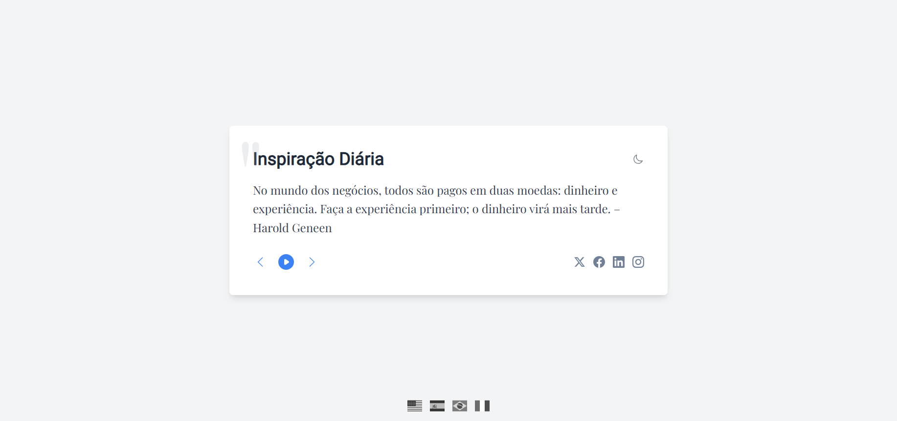

# Daily Quote Generator & Admin Dashboard



[](LICENSE)


[](https://www.docker.com/)


The **Daily Quote Generator & Admin Dashboard** is a comprehensive application featuring automated quote generation, sentiment analysis, and a modern admin interface. This project combines automation, API integration, machine learning analytics, and full-stack web development with containerization support.

## Technologies Used

### Core Technologies


### Frontend & Styling


### DevOps & Tools


## Table of Contents

- [Daily Quote Generator & Admin Dashboard](#daily-quote-generator--admin-dashboard)
  - [Application Components](#application-components)
  - [Features](#features)
  - [Architecture](#architecture)
  - [Getting Started](#getting-started)
    - [Prerequisites](#prerequisites)
    - [Installation](#installation)
    - [Usage](#usage)
  - [API Documentation](#api-documentation)
  - [Contributing](#contributing)
  - [License](#license)

## Application Components

This application consists of four main components:

### 🤖 **Daily Quote Generator** (`daily_quote.py`)
- **Purpose**: Automated quote fetching and repository updates
- **Features**: Fetches random inspirational quotes from API Ninjas, translates to multiple languages, commits to repository
- **Automation**: Runs daily via GitHub Actions
- **Languages**: English, Spanish, Portuguese, Italian

### 🌐 **Public Frontend** (`index.html`)
- **Purpose**: Public-facing website displaying daily quotes
- **Features**: Beautiful glassmorphism design, responsive layout, quote display
- **Technology**: Pure HTML/CSS/JavaScript
- **Access**: Available at repository root

### 🛠️ **Admin Dashboard Frontend** (`admin-dashboard/src/`)
- **Purpose**: Administrative interface for quote and system management
- **Features**: Quote CRUD operations, file management, analytics dashboard, system monitoring
- **Technology**: React 18 + TypeScript + Tailwind CSS + Vite
- **Port**: 3001 (development)

### 🔧 **Backend API** (`admin-dashboard/api/`)
- **Purpose**: RESTful API serving the admin dashboard and analytics
- **Features**: JWT authentication, quote management, sentiment analysis, vector operations, file handling
- **Technology**: FastAPI + SQLite + Python
- **Port**: 8000

### 📊 **Analytics Engine** (`backend/`)
- **Purpose**: Sentiment analysis and vector operations for quotes
- **Features**: VADER sentiment analysis, t-SNE visualization, vector embeddings
- **Technology**: Python + NLTK + scikit-learn + matplotlib
- **Integration**: Accessible via Backend API

## Features

### 🤖 **Core Automation**
- **Automated Quote Fetching**: Daily retrieval from [API Ninjas Quotes API](https://api-ninjas.com/api/quotes)
- **Multi-language Translation**: Spanish, Portuguese, and Italian via [MyMemory Translation API](https://mymemory.translated.net/doc/spec.php)
- **GitHub Integration**: Automatic commits and repository updates
- **Scheduled Execution**: GitHub Actions workflow for daily automation

### 🎨 **User Interfaces**
- **Public Website**: Beautiful glassmorphism design for quote display
- **Admin Dashboard**: Modern React interface with real-time updates
- **Responsive Design**: Mobile-first approach across all interfaces
- **Dark/Light Themes**: Adaptive styling for better user experience

### 📊 **Analytics & Intelligence**
- **Sentiment Analysis**: NLTK's VADER sentiment scoring
- **Vector Embeddings**: Quote similarity and clustering analysis
- **Data Visualization**: t-SNE plots and sentiment distribution charts
- **Performance Metrics**: System health monitoring and statistics

### 🔐 **Security & Management**
- **JWT Authentication**: Secure admin access with token-based auth
- **Role-based Access**: Administrative privileges and user management
- **API Rate Limiting**: Protection against abuse and overuse
- **Environment Configuration**: Secure credential management

### 🛠️ **Development & Deployment**
- **Dockerized Setup**: Complete containerization for easy deployment
- **RESTful API**: Well-documented endpoints for all operations
- **TypeScript Support**: Type-safe frontend development
- **Hot Reload**: Development servers with live updates
- **Comprehensive Logging**: Detailed monitoring and troubleshooting

## Screenshot


## Getting Started

Follow these instructions to set up and run the Daily Quote Generator on your local machine.

### Prerequisites

- **Python:** Version 3.8 or higher. [Download Python](https://www.python.org/downloads/)
- **Git:** For version control. [Download Git](https://git-scm.com/downloads)
- **Docker:** (Optional) For containerization. [Download Docker](https://www.docker.com/get-started)

### Installation

1. **Clone the Repository:**

   ```bash
   git clone https://github.com/hipnologo/daily_quote.git
   ```
2. **Navigate to the project directory:**
   ```
   cd daily_quote
   ```
3. **Install Python Dependencies:**
   It's recommended to use a virtual environment.
   ```
   python -m venv venv
   source venv/bin/activate  # On Windows: venv\Scripts\activate
   pip install --upgrade pip
   pip install -r requirements.txt
   ```
4. Install NLTK Data:
   The script uses NLTK's VADER for sentiment analysis.
   ```
   python -c "import nltk; nltk.download('vader_lexicon')"
   ```

### Usage

#### Daily Quote Generator
Run the script manually to generate and commit a new quote:
```bash
python daily_quote.py
```

#### Admin Dashboard
1. **Start the Backend API:**
   ```bash
   cd admin-dashboard/api
   python simple_main.py
   ```
   Backend will be available at `http://localhost:8000`

2. **Start the Frontend Dashboard:**
   ```bash
   cd admin-dashboard
   npm run dev --port 3001
   ```
   Dashboard will be available at `http://localhost:3001`

#### Docker Deployment
```bash
docker-compose up -d
```

#### Automation
The quote generation is automated via GitHub Actions and runs daily. You can also schedule locally using cron jobs (Linux/macOS) or Task Scheduler (Windows).

## Architecture

```
┌─────────────────┐    ┌──────────────────┐    ┌─────────────────┐
│   Public Web    │    │  Admin Dashboard │    │   Backend API   │
│   (index.html)  │    │  (React + TS)    │◄──►│  (FastAPI)      │
│                 │    │  Port: 3001      │    │  Port: 8000     │
└─────────────────┘    └──────────────────┘    └─────────────────┘
                                │                        │
                                │                        ▼
┌─────────────────┐    ┌──────────────────┐    ┌─────────────────┐
│ Quote Generator │    │   File System    │    │ Analytics Engine│
│ (daily_quote.py)│    │  (quotes_*.txt)  │    │ (sentiment.py)  │
│ GitHub Actions  │    │                  │    │ (vectors.py)    │
└─────────────────┘    └──────────────────┘    └─────────────────┘
```

## API Documentation

The Backend API provides comprehensive endpoints for:

- **Authentication**: `/auth/login`, `/auth/refresh`
- **Quotes**: `/quotes/` (CRUD operations)
- **Files**: `/files/` (quote file management)
- **Analytics**: `/analytics/sentiment`, `/analytics/vectors`
- **System**: `/system/health`, `/system/stats`

API documentation is available at `http://localhost:8000/docs` when running the backend.

## Contributing

We welcome contributions! Please see `CONTRIBUTING.md` for more details.

## License

This project is licensed under the Apache License 2.0 - see the `LICENSE` file for details.

Copyright 2024-2025 Fabio Carvalho

<a href="https://www.buymeacoffee.com/hipnologod" target="_blank"></a>


<p align="center"> <a href="https://github.com/hipnologo/daily_quote/issues">Report Bug</a> • <a href="https://github.com/hipnologo/daily_quote/issues">Request Feature</a> </p> ```
